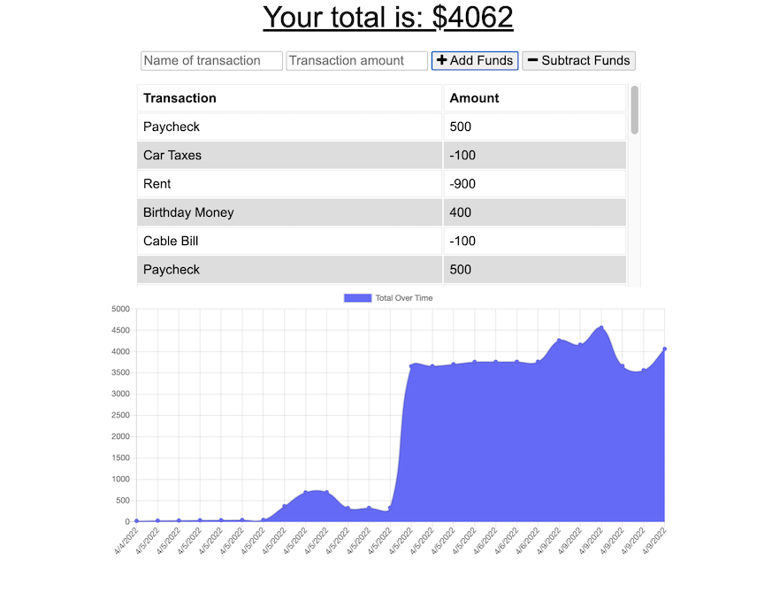

# Your_Personal_Budget_Tracer

## Description

The user is enable to keep track of their finances by allowing them to add expenses and deposits. The user is able to use the app online as well as offline. Built with React.js, Express.js and MongoDB.

Offline functionaltiy:  
-User can post expenses or deposits  
-Expenses and deposits will show on the budget tracker when the user regains internet connection.  

## Table of Contents

- [Installation](#Installation)
- [Usage](#Usage)
- [License](#License)
- [Questions](#Questions)
- [Heroku](#Heroku)

## Installation

Clone the repository to your local machine.

## Usage

From the root folder of this repository, run the commands `npm init -y` followed by `npm i`. To host the application locally use the command `npm start`. 

## License

A short and simple permissive license with conditions only requiring preservation of copyright and license notices. Licensed works, modifications, and larger works may be distributed under different terms and without source code.

## Questions

If you have any questions, concerns, or comments, feel free to contact me:

-GitHub: [Zacharycampanelli](https://github.com/Zacharycampanelli)  
-Email: [zaccamp@optonline.net](mailto:zaccamp@optonline.net)

## Heroku

View the deployed application:  
-[Heroku](https://agile-waters-92471.herokuapp.com/)